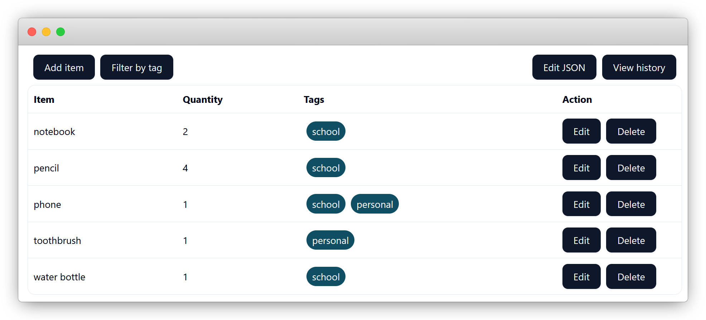

# item-console

A browser app that lets you track, tag, filter, and version everything you own.

## Features

- **Local storage**: All your data is saved in your browser's `localStorage` - no accounts, 100% private.
- **Tagging and filtering**: Organize items with custom tags and quickly filter them to find what you need.
- **Version history (Git-style)**: Every change is tracked, enabling you to instantly restore any previous version.
- **JSON editor**: Power users can directly access the underlying data as JSON.

## Screenshots

### Main dashboard

### Filtering by tag

### Version history

